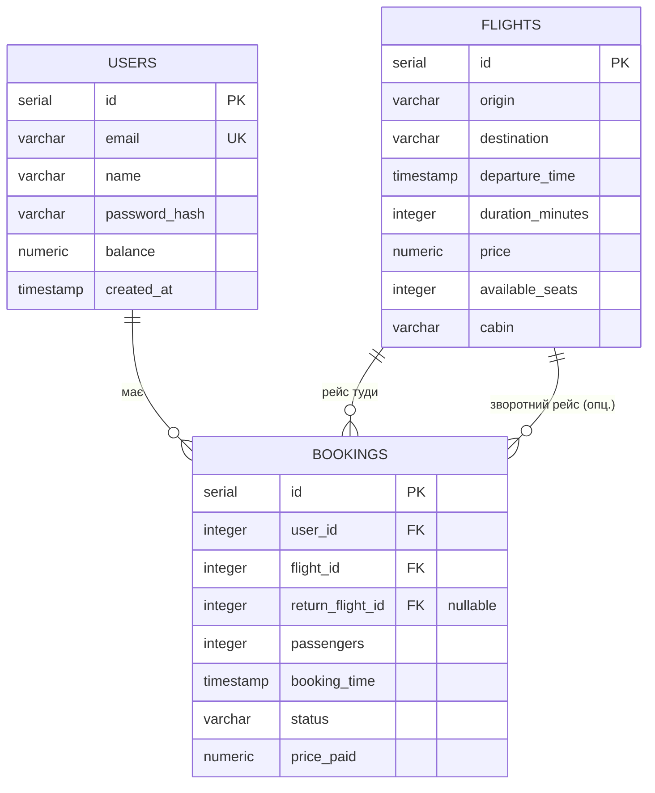

Міністерство освіти і науки України

Харківський національний університет радіоелектроніки

Факультет **Інформаційно-аналітичних технологій та менеджменту**
*(повна назва)*

Кафедра **Інформатика**
*(повна назва)*

Спеціальність **122 Комп'ютерні науки**

Освітньо-професійна програма **Інформатика**

---

# ПОЯСНЮВАЛЬНА ЗАПИСКА

до курсового проєкту з дисципліни **"Теорія програмування"**

за темою

**Веб-платформа пошуку та бронювання авіаквитків «AviaTickets»**
*(тема роботи)*

---

Виконав:

здобувач **3** року навчання, групи **ІТІНФ-23-2**

**Неділько Дмитро Сергійович**
*(власне ім'я, прізвище)*

Керівник _________ ст. викл. Сінельнікова Т.Ф.
*(підпис) (посада, власне ім'я, прізвище)*

Національна шкала ______________

Кількість балів: ________

Оцінка ЄКТС _______________

Члени комісії _______ зав. каф. Кобилін О. А.
*(підпис) (посада, власне ім'я, прізвище)*

_________ доц. Руденко Д. О.
*(підпис) (посада, власне ім'я, прізвище)*

_________ ст. викл. Сінельнікова Т.Ф.
*(підпис) (посада, власне ім'я, прізвище)*

Харків 2026 р.

---
<div style="page-break-after: always;"></div>

Харківський національний університет радіоелектроніки

Факультет **Інформаційно-аналітичних технологій та менеджменту**
Кафедра **Інформатика**
Спеціальність **Перший (бакалавр)**
Тип програми **освітньо-професійна**
Освітня програма **Інформатика**

ЗАТВЕРДЖУЮ:
Зав. кафедри ______________
«_____»________________ 2026 р.

## ЗАВДАННЯ
### на курсовий проєкт студента

**Неділько Дмитро Сергійович**
*(прізвище, ім'я, по батькові)*

**1. Тема роботи** Веб-платформа пошуку та бронювання авіаквитків

**2. Термін подання здобувачем роботи до захисту** 15 травня 2026 р.

**3. Вихідні дані до роботи** Принципи чистого коду, чистої архітектури, SOLID, патернів проєктування, рефакторинг, мікросервісна (клієнт-серверна, контейнеризована) архітектура, середовище розробки JetBrains WebStorm 2026.1, мова програмування TypeScript, фреймворк Node.js з фреймворком NestJS, ORM-інструмент Drizzle ORM, бібліотека валідації class-validator з class-transformer, механізм автентифікації JWT (passport-jwt) з хешуванням bcryptjs, СУБД PostgreSQL, бібліотека React 19 з фреймворком Next.js 16, бібліотека стилізації TailwindCSS, платформа контейнеризації Docker з оркестрацією Docker Compose.

**4. Перелік питань, що потрібно опрацювати в роботі** Вивчення та застосування принципів чистого коду, чистої архітектури, SOLID, патернів проєктування, рефакторингу та мікросервісної архітектури при розробці програмного забезпечення, реєстрація та авторизація користувача з механізмом JWT-токенів, пошук, фільтрація та сортування авіарейсів, бронювання квитків в одну та обидві сторони з фіксацією ціни на момент покупки, модель внутрішнього балансу користувача з можливістю поповнення, управління профілем користувача та історією бронювань, розгортання застосунку у контейнеризованій інфраструктурі на основі клієнт-серверної архітектури.

**5. Перелік графічного матеріалу** ER-діаграма бази даних, схема клієнт-серверної (контейнеризованої) архітектури застосунку, скріншоти інтерфейсу користувача.

### КАЛЕНДАРНИЙ ПЛАН

| № | Назва етапів роботи | Строк / терміни виконання | Примітка |
|---|---|---|---|
| 1 | Отримання завдання та ознайомлення з вимогами | 09.02.2026 | Виконано |
| 2 | Вивчення теоретичного матеріалу (Clean Code, SOLID, патерни, Clean Architecture) | 09.02.2026 – 14.04.2026 | Виконано |
| 3 | Проєктування бази даних та архітектури застосунку | 15.04.2026 – 19.04.2026 | Виконано |
| 4 | Розробка серверної частини (NestJS, Drizzle ORM, PostgreSQL) | 20.04.2026 – 27.04.2026 | Виконано |
| 5 | Розробка клієнтської частини (Next.js, React, TailwindCSS) | 28.04.2026 – 05.05.2026 | Виконано |
| 6 | Контейнеризація та розгортання застосунку (Docker, Docker Compose) | 06.05.2026 – 07.05.2026 | Виконано |
| 7 | Оформлення пояснювальної записки | 08.05.2026 – 13.05.2026 | Виконано |
| 8 | Захист курсового проєкту | 15.05.2026 | Виконано |

Дата видачі завдання 09 лютого 2026 р.

Здобувач ___________________________________ *(підпис)*

Керівник роботи _________________ ст. викл. Сінельнікова Т.Ф. *(підпис)*

---
<div style="page-break-after: always;"></div>

## РЕФЕРАТ

Пояснювальна записка: 55 с., 14 рис., 1 табл., 3 дод., 14 джерел.

ВЕБРОЗРОБКА, ЧИСТИЙ КОД, CLEAN ARCHITECTURE, SOLID, ПАТЕРНИ ПРОЄКТУВАННЯ, РЕФАКТОРИНГ, МІКРОСЕРВІСИ, КОНТЕЙНЕРИЗАЦІЯ, TYPESCRIPT, NODE.JS, NESTJS, DRIZZLE ORM, POSTGRESQL, JWT, REACT, NEXT.JS, TAILWINDCSS, DOCKER.

Курсовий проєкт присвячений розробці веб-платформи для пошуку та бронювання авіаквитків – AviaTickets. Платформа забезпечує реєстрацію та автентифікацію користувачів за допомогою JWT, пошук рейсів з фільтрацією за напрямком, датою, класом каюти та кількістю пасажирів, гнучке сортування результатів, бронювання квитків в одну та обидві сторони з фіксацією ціни на момент покупки, а також модель внутрішнього балансу користувача з можливістю поповнення. Метою роботи є розробка програмного забезпечення відповідно до принципів чистого коду, чистої архітектури, SOLID, патернів проєктування та мікросервісної (клієнт-серверної, контейнеризованої) архітектури з використанням сучасного стеку технологій: TypeScript, Node.js, NestJS, Drizzle ORM, PostgreSQL, React 19, Next.js 16, TailwindCSS та Docker.

## ABSTRACT

Explanatory note: 55 p., 14 pic., 1 tab., 3 attach., 14 sources.

WEB DEVELOPMENT, CLEAN CODE, CLEAN ARCHITECTURE, SOLID, DESIGN PATTERNS, REFACTORING, MICROSERVICES, CONTAINERIZATION, TYPESCRIPT, NODE.JS, NESTJS, DRIZZLE ORM, POSTGRESQL, JWT, REACT, NEXT.JS, TAILWINDCSS, DOCKER.

The course project is dedicated to the development of a web platform for searching and booking airline tickets – AviaTickets. The platform provides JWT-based user registration and authentication, flight search with filtering by route, date, cabin class and number of passengers, flexible sorting of results, booking of one-way and round-trip tickets with a price snapshot at the moment of purchase, and a user wallet (balance) model with top-up capability. The goal of the work is to develop software according to Clean Code, Clean Architecture, SOLID principles, design patterns and microservice (client-server, containerized) architecture using a modern technology stack: TypeScript, Node.js, NestJS, Drizzle ORM, PostgreSQL, React 19, Next.js 16, TailwindCSS and Docker.

---
<div style="page-break-after: always;"></div>

## ЗМІСТ

ПЕРЕЛІК УМОВНИХ ПОЗНАЧЕНЬ
ВСТУП
1 Принципи проєктування та розробки програмного забезпечення
&nbsp;&nbsp;1.1 Принципи чистого коду
&nbsp;&nbsp;1.2 Функції та їх роль у чистому коді
&nbsp;&nbsp;1.3 Принципи SOLID
&nbsp;&nbsp;1.4 Патерни проєктування програмного забезпечення
&nbsp;&nbsp;1.5 Чиста архітектура
&nbsp;&nbsp;1.6 Мікросервісна архітектура
&nbsp;&nbsp;1.7 Рефакторинг програмного забезпечення
&nbsp;&nbsp;1.8 Постановка задачі курсового проєкту
2 Проектування програмного забезпечення
&nbsp;&nbsp;2.1 Специфікація вимог
&nbsp;&nbsp;2.2 Вибір технологій для розробки
&nbsp;&nbsp;2.3 Проєктування бази даних
&nbsp;&nbsp;2.4 Архітектура проєкту
3 Розробка програмного забезпечення
&nbsp;&nbsp;3.1 Серверна частина програмного забезпечення
&nbsp;&nbsp;3.2 Клієнтська частина програмного забезпечення
Висновки
Перелік посилань
Додаток А. Посилання на програмний код
Додаток Б. Ілюстрація роботи ІС
Додаток В. Інструкція користувача

---
<div style="page-break-after: always;"></div>

## ПЕРЕЛІК УМОВНИХ ПОЗНАЧЕНЬ

API – Application Programming Interface (інтерфейс програмування застосунків)
БД – база даних
CORS – Cross-Origin Resource Sharing
DI – Dependency Injection (впровадження залежностей)
DTO – Data Transfer Object (об'єкт передачі даних)
ІС – інформаційна система
JWT – JSON Web Token
ORM – Object-Relational Mapping (об'єктно-реляційне відображення)
ПЗ – програмне забезпечення
REST – Representational State Transfer
SOLID – абревіатура п'яти принципів об'єктно-орієнтованого проєктування
SPA – Single Page Application (односторінковий застосунок)
SQL – Structured Query Language
SSR – Server-Side Rendering (рендеринг на боці сервера)
UI – User Interface (інтерфейс користувача)
URL – Uniform Resource Locator
UX – User Experience (досвід користувача)

---
<div style="page-break-after: always;"></div>

## ВСТУП

У сучасному світі цифрові технології суттєво змінюють підходи до планування подорожей. Придбання авіаквитків через фізичні каси та агентства поступово витісняється онлайн-рішеннями, які забезпечують доступність сервісу незалежно від часу та місця перебування користувача, дозволяють миттєво порівнювати десятки маршрутів і фіксувати ціну в момент покупки. Розробка якісних веб-платформ для пошуку та бронювання авіаквитків є актуальним завданням сучасної інженерії програмного забезпечення.

Метою даної курсової роботи є розробка веб-платформи AviaTickets для пошуку та бронювання авіаквитків з дотриманням принципів чистого коду, чистої архітектури, SOLID та патернів проєктування. Платформа реалізується з використанням сучасного стеку технологій: TypeScript, Node.js та NestJS на серверній стороні, Drizzle ORM з базою даних PostgreSQL, React з фреймворком Next.js та бібліотекою TailwindCSS на клієнтській стороні, а також class-validator для валідації даних. Розгортання виконується у контейнеризованому середовищі за допомогою Docker та Docker Compose.

Для досягнення поставленої мети необхідно вирішити такі задачі:

а) реалізувати систему реєстрації та автентифікації користувачів з механізмом JWT-токенів та безпечним зберіганням паролів;

б) розробити функціонал пошуку, фільтрації та сортування авіарейсів за напрямком вильоту й призначення, датою, класом каюти та кількістю пасажирів;

в) забезпечити можливість бронювання квитків в одну та обидві сторони із фіксацією ціни на момент покупки та атомарним резервуванням місць;

г) реалізувати модель внутрішнього балансу користувача з можливістю поповнення та оплати бронювань;

д) забезпечити валідацію вхідних даних на рівні як серверної, так і клієнтської частини застосунку;

е) розгорнути застосунок у контейнеризованій інфраструктурі з автоматичним виконанням міграцій та наповненням бази даних.

Практична цінність роботи полягає у створенні повноцінного застосунку, що демонструє застосування принципів чистої архітектури та патернів проєктування на реальному проєкті. Розроблена платформа може слугувати основою для подальшого розвитку у напрямку інтеграції реальних платіжних сервісів та провайдерів даних про рейси [1–5].

---
<div style="page-break-after: always;"></div>

# 1 ПРИНЦИПИ ПРОЄКТУВАННЯ ТА РОЗРОБКИ ПРОГРАМНОГО ЗАБЕЗПЕЧЕННЯ

## 1.1 Принципи чистого коду

Поняття чистого коду було систематизовано Робертом Мартіном у книзі «Clean Code» і описує сукупність практик написання програмного коду, який легко читати, розуміти та підтримувати. На відміну від коду, що просто виконує задачу, чистий код враховує інтереси розробника, який працюватиме з ним у майбутньому [1].

Одним із ключових аспектів чистого коду є правильне іменування. Імена змінних, функцій та класів повинні чітко відображати їхнє призначення, без скорочень та абревіатур, що потребують додаткового пояснення. У проєкті AviaTickets функція з назвою `buildSearchConditions` однозначно описує свою дію — побудову умов фільтрації, тоді як абстрактна назва на кшталт `process` не несе жодної корисної інформації.

Важливим принципом є правило однієї відповідальності на рівні функцій: кожна функція повинна виконувати лише одну дію і виконувати її добре. Якщо для опису функції потрібно використовувати слово «і», це сигнал, що її варто розділити на кілька менших. У проєкті логіку обробки пошукового запиту розділено на дві самостійні функції — `buildSearchConditions`, що формує умови фільтрації, та `buildSortClauses`, що формує правила сортування.

Чистий код передбачає відмову від магічних чисел – числових літералів без пояснення їхнього змісту. У проєкті AviaTickets ставка податку винесена в іменовану константу `TAX_RATE = 0.12`, стартовий баланс — у `STARTER_BALANCE`, а кількість раундів хешування — у `BCRYPT_ROUNDS`, що робить код самодокументованим і спрощує подальшу зміну значень.

Окремої уваги заслуговує обробка помилок. Чистий код не приховує помилки через повернення `null` або порожніх об'єктів – натомість використовуються іменовані виняткові ситуації, які чітко описують, що саме пішло не так. У проєкті використовуються типізовані винятки NestJS (`ConflictException`, `UnauthorizedException`, `NotFoundException`, `BadRequestException`), які централізовано перехоплюються глобальним фільтром помилок.

Коментарі у чистому коді застосовуються лише тоді, коли код не може пояснити себе сам. Хороший коментар пояснює, чому прийнято певне рішення, а не що робить наступний рядок. У проєкті коментарі присутні лише там, де логіка неочевидна — наприклад, пояснення, чому стовпець `duration_minutes` додається спочатку як nullable для коректного backfill наявних рядків [1].

## 1.2 Функції та їх роль у чистому коді

Функції є основними будівельними блоками будь-якої програми. Роберт Мартін формулює низку вимог до функцій, дотримання яких суттєво підвищує читабельність та підтримуваність коду [1].

Першою і найважливішою вимогою є компактність функції. Функція повинна виконувати рівно одну дію. У проєкті AviaTickets допоміжні функції `normalizeEmail`, `computeTotal`, `toFlightDto` та `toPublicUser` є компактними та виконують рівно одну операцію кожна.

Другою вимогою є єдиний рівень абстракції — всі інструкції всередині функції повинні знаходитись на одному рівні абстракції. У проєкті контролер не містить жодної бізнес-логіки — він лише отримує дані з HTTP-запиту, передає їх сервісу та повертає відповідь. Вся логіка перевірок знаходиться виключно у сервісному шарі.

Третьою вимогою є принцип розділення команд і запитів: функція або змінює стан системи, або повертає дані. У проєкті метод `FlightsService.searchFlights` лише читає дані й не змінює стану, тоді як `BookingsService.createBooking` виконує зміну стану в межах транзакції. Жодна з функцій не поєднує читання зі зміною стану непрозоро.

Четвертою вимогою є обмежена кількість аргументів функції. Ідеальна функція має нуль аргументів, допустима — один або два. У проєкті для передачі складних наборів даних використовуються об'єкти-DTO (`CreateBookingDto`, `SearchFlightsDto`) та інтерфейси аргументів (`CreateBookingArgs`), що дозволяє уникнути довгих списків параметрів і робить виклики функцій більш зрозумілими.

П'ятою вимогою є уникнення побічних ефектів — функція не повинна змінювати стан системи поза межами свого явного призначення. Функція `toFlightDto` у проєкті виключно перетворює рядок бази даних на DTO (зокрема, приводить ціну з рядкового типу `numeric` до числа) і не змінює жодних даних, що гарантує передбачуваність її поведінки при повторних викликах [1].

## 1.3 Принципи SOLID

SOLID – абревіатура п'яти принципів об'єктно-орієнтованого проєктування, сформульованих Робертом Мартіном, які спрямовані на створення гнучкого, розширюваного та підтримуваного програмного забезпечення [3].

### 1.3.1 Принцип єдиної відповідальності (Single Responsibility Principle)

Кожен модуль або клас повинен мати лише одну причину для зміни. У проєкті AviaTickets кожен функціональний модуль NestJS (`auth`, `users`, `flights`, `bookings`) розділено на окремі класи з єдиною зоною відповідальності — контролер відповідає лише за HTTP-взаємодію, сервіс — за бізнес-логіку, DTO — за опис структури вхідних даних, а мапери (`flight.mapper`, `user.mapper`) — за перетворення доменних об'єктів у відповіді API.

### 1.3.2 Принцип відкритості/закритості (Open/Closed Principle)

Програмні сутності повинні бути відкриті для розширення, але закриті для модифікації. У проєкті глобальний `ValidationPipe` реалізує цей принцип – він приймає будь-який DTO-клас, анотований декораторами class-validator, що дозволяє додавати валідацію для нових ендпоінтів без жодної зміни самого механізму перевірки. Аналогічно, функція `buildSortClauses` дозволяє додати новий критерій сортування, розширивши перелік варіантів без зміни логіки виконання запиту.

### 1.3.3 Принцип підстановки Лісков (Liskov Substitution Principle)

Об'єкти похідних типів повинні замінювати об'єкти базових типів без порушення коректності програми. У проєкті ієрархія винятків NestJS дотримується цього принципу – `ConflictException`, `UnauthorizedException`, `NotFoundException` та `BadRequestException` є підтипами `HttpException` і обробляються глобальним фільтром помилок однаково, без перевірок конкретного типу. Так само `JwtAuthGuard` коректно підставляється замість базового `AuthGuard('jwt')`.

### 1.3.4 Принцип розділення інтерфейсів (Interface Segregation Principle)

Клієнти не повинні залежати від інтерфейсів, які вони не використовують. У проєкті DTO розділені відповідно до конкретних операцій – `RegisterDto` містить лише поля для реєстрації, `LoginDto` — лише для входу, `SearchFlightsDto` — лише параметри пошуку, а `CreateBookingDto` — лише дані бронювання. Окремо інтерфейс `PublicUser` та мапер `toPublicUser` гарантують, що клієнт ніколи не отримує службових полів, таких як `passwordHash`.

### 1.3.5 Принцип інверсії залежностей (Dependency Inversion Principle)

Модулі верхнього рівня не повинні залежати від модулів нижнього рівня – обидва повинні залежати від абстракцій. У проєкті сервіси отримують доступ до бази даних через абстрактний токен `DRIZZLE`, впроваджений механізмом Dependency Injection NestJS, а не звертаються до конкретного `pg`-клієнта безпосередньо. Завдяки цьому при потребі змінити параметри підключення або драйвер достатньо змінити лише провайдер `drizzleProvider` – сервісний шар не потребуватиме жодних змін, оскільки він залежить від інтерфейсу взаємодії `DrizzleDB`, а не від конкретної реалізації [3].

## 1.4 Патерни проєктування програмного забезпечення

Патерни проєктування – це типові рішення для часто повторюваних проблем у програмуванні. Вони не є готовим кодом, який можна скопіювати, а радше описом підходу, який необхідно адаптувати під конкретну задачу. Класифікацію патернів систематизовано у роботі Гамми та співавторів, де їх розділено на три категорії: породжувальні, структурні та поведінкові [5].

### 1.4.1 Породжувальні патерни

Породжувальні патерни відповідають за створення об'єктів, приховуючи логіку їх ініціалізації від клієнтського коду.

Патерн **Singleton** забезпечує існування лише одного екземпляру у межах застосунку. У проєкті AviaTickets цей патерн застосовано для підключення до бази даних – єдиний пул з'єднань `pg.Pool` створюється у провайдері `drizzleProvider` всередині глобального модуля `DrizzleModule` і використовується всіма сервісами. Це запобігає надмірному відкриттю з'єднань з базою даних. Варто зазначити, що всі провайдери NestJS за замовчуванням є синглтонами в межах контейнера впровадження залежностей.

Патерн **Factory Method** визначає інтерфейс для створення об'єктів. У проєкті фабрика `useFactory` провайдера `drizzleProvider` асинхронно створює екземпляр Drizzle, приховуючи деталі його ініціалізації. Функції-мапери `toFlightDto` та `toPublicUser` також реалізують ідею фабричних функцій – вони централізовано створюють об'єкти-відповіді з гарантовано однаковою структурою.

### 1.4.2 Структурні патерни

Структурні патерни описують способи організації класів та об'єктів у більші структури.

Патерн **Facade** надає спрощений інтерфейс до складної підсистеми. Сервісний шар у проєкті виступає фасадом між контролером та операціями з базою даних – контролер бронювання не знає, що метод `createBooking` усередині транзакції перевіряє користувача, отримує рейси, резервує місця, списує баланс та створює запис бронювання.

Патерн **Adapter (Mapper)** перетворює інтерфейс одного об'єкта в інтерфейс, очікуваний клієнтом. У проєкті мапери `flight.mapper` та `user.mapper` адаптують рядки бази даних (де грошові значення зберігаються як рядки типу `numeric`) до DTO з числовими полями, очікуваними клієнтською частиною.

### 1.4.3 Поведінкові патерни

Поведінкові патерни описують способи взаємодії між об'єктами та розподіл відповідальності між ними.

Патерн **Strategy** визначає сімейство алгоритмів, інкапсулює кожен з них і робить їх взаємозамінними. У проєкті функція `buildSortClauses` реалізує цей патерн – залежно від обраної стратегії сортування (`best`, `cheapest`, `fastest`, `earliest`) вона повертає відповідний набір правил впорядкування. Так само механізм Passport із `JwtStrategy` є реалізацією стратегії автентифікації.

Патерн **Chain of Responsibility** передає запит по ланцюжку обробників. У проєкті цей патерн реалізовано через конвеєр обробки запитів NestJS – кожен запит послідовно проходить через `ValidationPipe`, далі через `JwtAuthGuard` (для захищених маршрутів), потім через контролер, а будь-яка помилка перехоплюється глобальним `HttpExceptionFilter`, що зупиняє ланцюжок і повертає стандартизовану відповідь клієнту.

Патерн **Decorator** динамічно додає об'єкту нову поведінку. NestJS повністю побудований на декораторах (`@Controller`, `@Injectable`, `@Get`, `@Post`, `@UseGuards`, `@Body`). У проєкті розроблено власний параметр-декоратор `@CurrentUser`, що інкапсулює отримання автентифікованого користувача з об'єкта запиту, а також застосовано декоратори class-validator (`@IsEmail`, `@IsInt`, `@Min`, `@Max`) для оголошення правил валідації [5].

## 1.5 Чиста архітектура

Чиста архітектура – це підхід до організації програмного забезпечення, запропонований Робертом Мартіном, який спрямований на створення систем з чітким розділенням відповідальностей між шарами. Головна ідея полягає у тому, що бізнес-логіка застосунку повинна бути незалежною від фреймворків, баз даних, інтерфейсу користувача та будь-яких зовнішніх інструментів [2].

Мартін формулює основне правило залежностей: залежності у коді повинні спрямовуватись лише в одному напрямку – від зовнішніх шарів до внутрішніх. Внутрішні шари не повинні знати нічого про зовнішні. Це означає, що бізнес-логіка не залежить від того, яка база даних використовується або який фреймворк обробляє HTTP-запити.

У серверній частині проєкту AviaTickets реалізовано модульну шарувату архітектуру на базі NestJS, яка відповідає принципам чистої архітектури:

**Шар контролерів** (`*.controller.ts`) відповідає за отримання даних з HTTP-запиту та формування HTTP-відповіді. Контролер не містить бізнес-логіки – він лише викликає відповідний метод сервісу та повертає результат клієнту.

**Шар сервісів** (`*.service.ts`) містить всю бізнес-логіку застосунку. Сервіс не знає про існування HTTP-запитів напряму та оперує доменними об'єктами. Саме тут зосереджені перевірки, транзакції та обчислення.

**Шар доступу до даних** реалізовано через провайдер Drizzle (`DRIZZLE`), який є єдиною точкою взаємодії з базою даних PostgreSQL. Сервіси отримують типобезпечний клієнт `DrizzleDB` через впровадження залежностей і не залежать від деталей встановлення з'єднання.

**Допоміжні шари** – DTO та `ValidationPipe` для валідації на межі застосунку, guards та Passport-стратегія для автентифікації, мапери для перетворення доменних об'єктів, а також глобальний фільтр винятків для обробки помилок.

Така організація коду забезпечує незалежність компонентів – кожен шар може змінюватись або тестуватись окремо від інших. Наприклад, сервісний шар можна протестувати з підробленим екземпляром `DrizzleDB` без необхідності підключення до реальної бази даних. Це є однією з ключових переваг чистої архітектури порівняно з монолітними підходами, де логіка, маршрутизація та запити до бази даних змішані в одному місці [2].

## 1.6 Мікросервісна архітектура

Мікросервісна архітектура – це підхід до розробки програмного забезпечення, при якому застосунок будується як набір невеликих незалежних сервісів, що взаємодіють між собою через мережеві інтерфейси. Кожен сервіс відповідає за окрему функціональну область, розгортається незалежно та може використовувати власний технологічний стек [14].

Різновидом мікросервісної архітектури є клієнт-серверна архітектура, яка реалізує розподіл застосунку на незалежні частини, що взаємодіють через стандартизований інтерфейс. Клієнт відповідає за відображення даних та взаємодію з користувачем, сервер – за бізнес-логіку та збереження даних [14].

У проєкті AviaTickets реалізовано клієнт-серверну контейнеризовану архітектуру, що складається з трьох незалежних сервісів, оркестрованих через Docker Compose:

- **Frontend-сервіс** – Next.js-застосунок, що працює у власному контейнері на порту 3000, відповідає за інтерфейс користувача та взаємодіє з backend через REST API (запити проксіюються з шляху `/api/*`);

- **Backend-сервіс** – NestJS API, що працює у контейнері на порту 3001, містить всю бізнес-логіку та надає REST API для клієнтської частини;

- **Database-сервіс** – PostgreSQL 15, що працює у контейнері на порту 5432 з постійним томом для збереження даних.

Кожен сервіс має власний `Dockerfile`, розгортається незалежно і може оновлюватись без впливу на інші. Взаємодія між сервісами відбувається у межах внутрішньої мережі Docker. Порядок запуску контролюється через механізм перевірок працездатності (`healthcheck`): backend стартує лише після того, як база даних готова приймати з'єднання, а frontend – лише після того, як backend починає відповідати на запити. Таким чином, кожна частина застосунку є самодостатнім, ізольованим та незалежно масштабованим компонентом.

## 1.7 Рефакторинг програмного забезпечення

Рефакторинг – це процес зміни внутрішньої структури програмного забезпечення без зміни його зовнішньої поведінки [4]. Метою рефакторингу є покращення читабельності, підтримуваності та розширюваності коду, а не додавання нової функціональності або виправлення помилок.

Мартін Фаулер визначає рефакторинг як дисципліновану техніку, яка застосовується невеликими кроками, кожен з яких не порушує працездатність системи. Саме поступовість є ключовою відмінністю рефакторингу від повного переписування коду.

Одним із найпоширеніших сигналів необхідності рефакторингу є так звані «запахи коду» – ознаки, що вказують на потенційні проблеми у структурі. До основних запахів коду належать:

- дублювання коду, коли однакова логіка присутня у кількох місцях;
- надмірно довгі функції, що виконують занадто багато дій;
- великі класи або модулі з надмірною кількістю відповідальностей;
- довгі списки параметрів функцій;
- коментарі, що пояснюють незрозумілий код замість того, щоб код був переписаний на зрозумілий.

Фаулер описує конкретні техніки усунення запахів коду. Техніка **Extract Function** передбачає виділення фрагменту коду в окрему іменовану функцію. Техніка **Replace Magic Number with Symbolic Constant** замінює числові літерали на іменовані константи. Техніка **Move Function** переміщує функцію до того модуля, з яким вона найбільш тісно пов'язана за змістом.

Проєкт AviaTickets є результатом поетапного рефакторингу та розширення початкової версії застосунку. Це наочно зафіксовано у файлі міграцій `migrate.ts`: в оригінальній схемі таблиця `flights` не містила тривалості польоту (`duration_minutes`) та класу каюти (`cabin`), користувачі (`users`) не мали полів пароля (`password_hash`) та балансу (`balance`), а бронювання (`bookings`) не зберігали зафіксовану ціну (`price_paid`), кількість пасажирів (`passengers`) та посилання на зворотний рейс (`return_flight_id`). У процесі еволюції застосунку схему поступово розширено через ідемпотентні міграції (`ALTER TABLE ... ADD COLUMN IF NOT EXISTS`) з коректним backfill наявних даних.

Паралельно зі зміною схеми було застосовано техніки чистого коду: повторювані обчислення винесено в окремі функції (`computeTotal`, `buildSearchConditions`, `buildSortClauses`), магічні числа замінено на іменовані константи (`TAX_RATE`, `STARTER_BALANCE`, `BCRYPT_ROUNDS`), а перетворення доменних об'єктів централізовано у маперах. У результаті кожен аспект логіки винесено у відповідний шар або окремий модуль відповідно до принципів чистої архітектури та чистого коду [4].

## 1.8 Постановка задачі курсового проєкту

Метою курсового проєкту є розробка веб-платформи AviaTickets для пошуку та бронювання авіаквитків з дотриманням принципів чистого коду, чистої архітектури та патернів проєктування [1-5].

Предметною областю проєкту є організація онлайн-продажу авіаквитків. Платформа охоплює повний цикл взаємодії між пасажиром та системою – від пошуку відповідного рейсу до отримання підтвердження бронювання та перегляду його історії.

Користувачем системи є зареєстрований пасажир, який може переглядати та шукати доступні рейси, фільтрувати їх за напрямком, датою, класом каюти та кількістю пасажирів, сортувати результати, бронювати квитки в одну та обидві сторони, оплачувати бронювання з внутрішнього балансу, поповнювати баланс, а також керувати власним профілем і переглядати історію бронювань.

Для досягнення мети необхідно вирішити такі задачі:

а) реалізувати систему реєстрації та автентифікації з механізмом JWT-токенів та безпечним хешуванням паролів через bcrypt;

б) розробити функціонал пошуку, фільтрації та сортування рейсів з підтримкою односторонніх та двосторонніх (round-trip) маршрутів;

в) реалізувати модуль бронювання квитків з фіксацією ціни на момент покупки, обчисленням податку та атомарним резервуванням місць, стійким до стану гонитви;

г) реалізувати модель внутрішнього балансу користувача з перевіркою достатності коштів та можливістю поповнення;

д) забезпечити валідацію вхідних даних на рівні як серверної, так і клієнтської частини застосунку;

е) розгорнути застосунок у контейнеризованій інфраструктурі з автоматичним виконанням міграцій та наповненням бази даних демонстраційними рейсами.

Для реалізації застосунку обрано наступні засоби розробки: мова програмування TypeScript, середовище виконання Node.js з фреймворком NestJS для серверної частини, ORM-інструмент Drizzle з базою даних PostgreSQL, бібліотека React з фреймворком Next.js та бібліотекою TailwindCSS для клієнтської частини, бібліотека class-validator для валідації даних, механізм JWT для автентифікації, а також платформа Docker з Docker Compose для контейнеризації та розгортання [6-14].

---
<div style="page-break-after: always;"></div>

# 2 ПРОЕКТУВАННЯ ПРОГРАМНОГО ЗАБЕЗПЕЧЕННЯ

## 2.1 Специфікація вимог

### 2.1.1 Перелік та опис користувачів

Система орієнтована на один тип користувача – зареєстрованого пасажира. Пасажир має можливість реєстрації та автентифікації, пошуку та фільтрації рейсів за напрямком, датою, класом каюти та кількістю пасажирів, сортування результатів за різними критеріями, бронювання квитків в одну або обидві сторони, оплати бронювань з внутрішнього балансу та його поповнення, а також перегляду власного профілю та історії бронювань.

### 2.1.2 Вимоги до даних

Для коректної роботи системи необхідно зберігати такі дані:

- **Користувачі**: ідентифікатор, ім'я, електронна пошта (унікальна), пароль у хешованому вигляді, баланс рахунку, дата реєстрації.
- **Рейси**: ідентифікатор, місто/аеропорт вильоту, місто/аеропорт призначення, час відправлення, тривалість польоту у хвилинах, ціна квитка, кількість доступних місць, клас каюти (economy, premium, business, first).
- **Бронювання**: ідентифікатор, посилання на користувача, посилання на рейс «туди», необов'язкове посилання на зворотний рейс, кількість пасажирів, дата бронювання, статус бронювання, сплачена сума (ціна на момент покупки з урахуванням податку).

### 2.1.3 Вимоги до функціональності

а) реєстрація та автентифікація з механізмом JWT-токенів (термін дії 7 днів);

б) пошук та фільтрація рейсів за містом вильоту, містом призначення, датою, класом каюти та кількістю пасажирів;

в) сортування результатів пошуку за стратегіями «найкращі», «найдешевші», «найшвидші» та «найраніші»;

г) бронювання квитків в одну сторону та round-trip з фіксацією ціни та перевіркою достатності балансу;

д) атомарне резервування місць на рейсі з контролем доступної кількості;

е) перегляд історії бронювань з інформацією про рейс, кількість пасажирів, статус та сплачену суму;

ж) перегляд балансу та його поповнення на фіксовані суми.

### 2.1.4 Вимоги до запитів

**Запити на отримання інформації:**

а) пошук рейсів з фільтрацією та сортуванням (`GET /flights`);

б) отримання даних поточного користувача (`GET /auth/me`, `GET /users/me`);

в) перегляд історії бронювань користувача (`GET /bookings/me`).

**Запити на зміну даних:**

а) реєстрація та автентифікація користувача (`POST /auth/register`, `POST /auth/login`);

б) бронювання квитків (`POST /bookings`);

в) поповнення балансу (`POST /users/me/top-up`).

## 2.2 Вибір технологій для розробки

Вибір технологічного стеку є важливим архітектурним рішенням, яке впливає на продуктивність розробки, масштабованість системи та зручність підтримки. Нижче наведено обґрунтування вибору кожної технології.

### 2.2.1 Мова програмування

TypeScript обрано як основну мову програмування для обох частин застосунку. TypeScript є надмножиною JavaScript, що додає статичну типізацію, інтерфейси та узагальнені типи. Статична типізація дозволяє виявляти помилки на етапі компіляції, а не під час виконання, що суттєво підвищує надійність коду та спрощує рефакторинг. Єдина мова для серверної та клієнтської частини дозволяє використовувати спільні типи (наприклад, опис сутності `Flight`) [6].

### 2.2.2 Серверна частина

**Node.js** обрано як середовище виконання серверного коду завдяки асинхронній неблокуючій моделі введення-виведення, що робить його ефективним для обробки великої кількості одночасних HTTP-запитів [7].

**NestJS** обрано як серверний фреймворк. На відміну від мінімалістичних рішень, NestJS нав'язує чітку модульну архітектуру з вбудованим механізмом впровадження залежностей, що природно відповідає принципам чистої архітектури та SOLID. Поділ на модулі, контролери, сервіси та провайдери допомагає тримати код структурованим, а система guards, pipes та filters забезпечує наскрізну функціональність [8].

**Drizzle ORM** обрано як інструмент роботи з базою даних. Drizzle є легковажним типобезпечним ORM, який автоматично виводить TypeScript-типи зі схеми, описаної безпосередньо у коді. На відміну від написання SQL-запитів вручну, Drizzle унеможливлює цілий клас помилок, пов'язаних з невідповідністю типів, при цьому залишаючись максимально близьким до SQL і не приховуючи його семантику [9].

**class-validator** разом з **class-transformer** обрано для валідації вхідних даних. Бібліотека дозволяє описувати правила валідації у вигляді декораторів над полями DTO, а глобальний `ValidationPipe` NestJS автоматично застосовує їх до кожного запиту, відкидаючи зайві поля (`whitelist`) та приводячи типи (`transform`) [8].

Для автентифікації використано **JWT** (`@nestjs/jwt`, `passport-jwt`), а для безпечного зберігання паролів — **bcryptjs**.

### 2.2.3 База даних

**PostgreSQL** обрано як систему управління базами даних. PostgreSQL є потужною реляційною СУБД з підтримкою складних запитів, транзакцій та цілісності даних. Підтримка транзакцій є критичною для операції бронювання, де необхідно атомарно зарезервувати місця, списати кошти та створити запис. У межах розгортання використовується офіційний образ `postgres:15-alpine` з постійним томом для збереження даних [10].

### 2.2.4 Клієнтська частина

**React 19** обрано як бібліотеку для побудови інтерфейсу користувача завдяки компонентному підходу, що відповідає принципу єдиної відповідальності [11]. **Next.js 16** обрано як фреймворк над React – він надає файлову маршрутизацію (App Router), рендеринг на боці сервера, оптимізацію збірки та механізм проксіювання запитів (`rewrites`), що дозволяє звертатися до backend через єдиний домен і уникнути проблем CORS у браузері [12].

**TailwindCSS** обрано як бібліотеку стилізації. Утилітарний підхід Tailwind дозволяє швидко будувати узгоджений інтерфейс безпосередньо у розмітці, а кастомна тема (кольори `ink`, `ember`, `sky`, шрифти, анімації) забезпечує єдиний візуальний стиль платформи.

Для управління станом автентифікації використано вбудований механізм React Context у поєднанні з хуком `useSyncExternalStore`, що синхронізує стан з `localStorage` та підтримує синхронізацію між вкладками браузера без додаткових бібліотек.

### 2.2.5 Розгортання

Для розгортання обрано **Docker** та **Docker Compose**. Кожен сервіс (база даних, backend, frontend) пакується у власний контейнер, а Docker Compose оркеструє їх запуск, мережеву взаємодію та порядок старту через перевірки працездатності. Такий підхід гарантує ідентичність середовища на будь-якій машині та спрощує розгортання командою `docker compose up`.

## 2.3 Проєктування бази даних

Проєктування бази даних є ключовим етапом розробки інформаційної системи, що визначає структуру збереження даних та зв'язки між сутностями [10].

### 2.3.1 Визначення типів сутностей

- **Users (Користувачі)** – зберігає інформацію про користувачів системи та їхній баланс.
- **Flights (Рейси)** – інформація про авіарейси, доступні для бронювання.
- **Bookings (Бронювання)** – інформація про здійснені бронювання квитків.

### 2.3.2 Визначення типів зв'язків

Між сутностями визначено такі зв'язки:

- **Users ↔ Bookings** – один до багатьох (1:M): один користувач може мати кілька бронювань;
- **Flights ↔ Bookings (рейс «туди»)** – один до багатьох (1:M): один рейс може бути присутнім у багатьох бронюваннях як рейс відправлення;
- **Flights ↔ Bookings (зворотний рейс)** – один до багатьох (1:M): один рейс може бути присутнім у багатьох бронюваннях як зворотний рейс, зв'язок є необов'язковим (`return_flight_id` може бути `NULL` для односторонніх квитків).

### 2.3.3 ER-діаграма бази даних

На рисунку 2.1 наведено логічну ER-діаграму бази даних системи AviaTickets, що відображає всі сутності, їхні атрибути та зв'язки між ними.



*Рисунок 2.1 – Логічна ER-діаграма бази даних AviaTickets*

> Примітка: для оформлення у Word цю схему доцільно перемалювати графічним редактором (наприклад, dbdiagram.io або вбудованими засобами). Суцільна лінія `flight` позначає обов'язковий зв'язок, штрихова `return` – необов'язковий зворотний рейс.

### 2.3.4 Особливості проєктування

Під час проєктування схеми прийнято три ключових рішення.

По-перше, кількість доступних місць зберігається у полі `available_seats` таблиці `Flights` і змінюється виключно умовним атомарним запитом усередині транзакції бронювання (`UPDATE ... SET available_seats = available_seats - N WHERE id = ? AND available_seats >= N`). Така конструкція унеможливлює перепродаж місць та виникнення стану гонитви при одночасному бронюванні кількома користувачами, оскільки перевірка наявності та зменшення лічильника відбуваються в одній неподільній операції.

По-друге, таблиця `Bookings` містить поле `price_paid`. Фіксація сплаченої суми на момент бронювання (з урахуванням 12% податку) гарантує незмінність фінансових даних при подальших змінах ціни рейсу. Поле `passengers` дозволяє зберігати кілька місць в одному записі бронювання.

По-третє, поле `return_flight_id` є необов'язковим зовнішнім ключем на ту ж таблицю `Flights`, що дозволяє представити двосторонній (round-trip) маршрут одним записом бронювання без створення додаткової сутності. Для односторонніх квитків це поле залишається `NULL`.

## 2.4 Архітектура проєкту

Архітектура проєкту AviaTickets побудована відповідно до принципів чистої архітектури і реалізує чіткий розподіл відповідальностей між шарами як на серверній, так і на клієнтській стороні застосунку.

### 2.4.1 Загальна структура

Застосунок складається з двох незалежних частин – серверної та клієнтської, які взаємодіють через REST API, а також бази даних. Серверна частина розміщена у папці `backend`, клієнтська – у папці `frontend`, а оркестрація всіх сервісів описана у файлі `docker-compose.yml` у корені проєкту. Загальну архітектуру проєкту зображено на рисунку 2.2.

```
        КЛІЄНТ (Docker :3000)              СЕРВЕР (Docker :3001)            БД (Docker :5432)
┌──────────────────────────────┐   ┌──────────────────────────────┐   ┌────────────────────┐
│           Next.js 16          │   │            NestJS 10          │   │   PostgreSQL 15    │
│──────────────────────────────│   │──────────────────────────────│   │────────────────────│
│ app/      (App Router)        │   │ main.ts  (bootstrap)         │   │  users             │
│ components/ (UI)              │   │ auth/    (controller/service)│   │  flights           │
│ lib/api.ts  (fetch-клієнт)    │◄─►│ users/   (controller/service)│◄─►│  bookings          │
│ lib/auth-context.tsx          │   │ flights/ (controller/service)│   │                    │
│ types/                        │   │ bookings/(controller/service)│   │  (volume: pgdata)  │
│                               │   │ db/      (Drizzle provider)  │   │                    │
│ React 19 · TailwindCSS        │   │ common/  (exception filter)  │   │                    │
│                               │   │ Drizzle ORM · JWT · bcrypt   │   │                    │
└──────────────────────────────┘   └──────────────────────────────┘   └────────────────────┘
        │  /api/* (rewrites)  ──── REST API / JSON ────►  │     Drizzle / pg pool ────►  │
                          Внутрішня мережа Docker Compose (healthchecks)
```

*Рисунок 2.2 – Клієнт-серверна (контейнеризована) архітектура проєкту AviaTickets*

### 2.4.2 Архітектура серверної частини

Серверна частина реалізує модульну архітектуру NestJS. Кореневий модуль `AppModule` імпортує функціональні модулі та глобальний модуль бази даних. Залежності між шарами спрямовані лише в одному напрямку – від зовнішніх до внутрішніх, що відповідає правилу залежностей чистої архітектури [2].

**Шар контролерів** (`*.controller.ts`) визначає HTTP-маршрути за допомогою декораторів та відповідає за отримання даних з запиту й формування відповіді. Контролер делегує всю обробку відповідному сервісу.

**Шар сервісів** (`*.service.ts`) містить всю бізнес-логіку. Сервіси є провайдерами, що впроваджуються через конструктор, та оперують доменними об'єктами.

**Шар доступу до даних** реалізовано через глобальний `DrizzleModule` та провайдер `drizzleProvider`, що надає єдиний типобезпечний клієнт `DrizzleDB` за токеном `DRIZZLE`. Це єдине місце у застосунку, де встановлюється з'єднання з PostgreSQL.

**Допоміжні компоненти** – DTO та глобальний `ValidationPipe`, `JwtAuthGuard` і `JwtStrategy` для автентифікації, параметр-декоратор `CurrentUser`, мапери та глобальний `HttpExceptionFilter`.

Структуру серверної частини наведено у таблиці 2.1.

*Таблиця 2.1 – Структура модулів серверної частини*

| Модуль | Файли | Відповідальність |
|---|---|---|
| auth | controller, service, dto, jwt.strategy, jwt-auth.guard, current-user.decorator | Реєстрація, автентифікація, видача та перевірка JWT |
| users | controller, service, dto, user.mapper | Профіль користувача, баланс, поповнення |
| flights | controller, service, dto, flight.mapper | Пошук, фільтрація та сортування рейсів |
| bookings | controller, service, dto | Бронювання квитків, історія бронювань |
| db | drizzle.module, drizzle.provider, schema, migrate, seed | Підключення до БД, схема, міграції, наповнення |
| common | filters/http-exception.filter | Глобальна обробка помилок |

### 2.4.3 Архітектура клієнтської частини

Клієнтська частина побудована на основі компонентного підходу React та файлової маршрутизації Next.js (App Router) з чітким розділенням відповідальностей між шарами.

**Шар сторінок** (`app/`) містить маршрути застосунку: головну сторінку пошуку й бронювання (`app/page.tsx`), сторінку особистого кабінету (`app/account/page.tsx`), а також статичні сторінки (`help`, `terms`, `privacy`, `cookies`). Кореневий макет `app/layout.tsx` огортає застосунок у `AuthProvider`.

**Шар компонентів** (`components/`) містить перевикористовувані UI-компоненти: форму пошуку (`FlightSearchForm`), картку рейсу (`FlightCard`), модальне вікно бронювання (`BookingModal`), модальне вікно автентифікації (`AuthModal`), вибір дати (`DatePicker`), сповіщення (`Toast`), а також шапку та підвал сайту.

**Шар API** (`lib/api.ts`) містить тонкий fetch-клієнт з функціями `apiGet` та `apiPost`, що автоматично додають заголовок `Authorization` та обробляють помилку простроченого токена (`AuthExpiredError`).

**Шар стану** (`lib/auth-context.tsx`) реалізує контекст автентифікації на основі `useSyncExternalStore`, що зберігає токен і дані користувача у `localStorage` та синхронізує їх між вкладками браузера.

**Шар типів** (`types/`) містить спільні TypeScript-інтерфейси (`Flight`, `MyBooking`, `SearchParams`, `AuthUser` тощо), що забезпечують типобезпечну взаємодію з API.

### 2.4.4 Взаємодія між частинами

Клієнтська частина взаємодіє з серверною виключно через REST API. Завдяки механізму `rewrites` Next.js усі запити з префіксом `/api/*` прозоро проксіюються на backend (адреса визначається змінною середовища `BACKEND_URL`), що дозволяє уникнути проблем CORS та звертатися до сервера через єдиний домен. Серверна частина повертає відповіді у форматі JSON, а у разі помилки – стандартизований об'єкт з полями `statusCode`, `message` та `timestamp`, що формується глобальним фільтром винятків.

---
<div style="page-break-after: always;"></div>

# 3 РОЗРОБКА ПРОГРАМНОГО ЗАБЕЗПЕЧЕННЯ

## 3.1 Серверна частина програмного забезпечення

Серверна частина застосунку AviaTickets реалізована на основі Node.js з фреймворком NestJS та мовою TypeScript. Вхідною точкою застосунку є файл `main.ts`, що створює застосунок, вмикає CORS, реєструє глобальний `ValidationPipe` та глобальний фільтр помилок, після чого запускає HTTP-сервер на порту, визначеному через змінну середовища, як показано у лістингу 3.1.

*Лістинг 3.1 – Ініціалізація застосунку у main.ts*

```ts
async function bootstrap(): Promise<void> {
  const app = await NestFactory.create(AppModule);

  app.enableCors();

  app.useGlobalPipes(
    new ValidationPipe({
      transform: true,
      whitelist: true,
    }),
  );

  app.useGlobalFilters(new HttpExceptionFilter());

  const port = process.env.PORT || 3001;
  await app.listen(port);
}
```

### 3.1.1 Підключення до бази даних

Підключення до бази даних реалізовано як глобальний провайдер за патерном Singleton. Єдиний пул з'єднань `pg.Pool` створюється фабрикою `useFactory` та надається всім модулям через токен `DRIZZLE`, як показано у лістингу 3.2.

*Лістинг 3.2 – Провайдер Drizzle (Singleton + Dependency Inversion)*

```ts
export const DRIZZLE = Symbol('DRIZZLE');
export type DrizzleDB = NodePgDatabase<typeof schema>;

export const drizzleProvider = {
  provide: DRIZZLE,
  useFactory: async (): Promise<DrizzleDB> => {
    const pool = new Pool({ connectionString: process.env.DATABASE_URL });
    return drizzle(pool, { schema });
  },
};
```

Опис схеми бази даних виконано декларативно засобами Drizzle, що автоматично виводить TypeScript-типи, як показано у лістингу 3.3.

*Лістинг 3.3 – Опис схеми бази даних через Drizzle*

```ts
export const flights = pgTable('flights', {
  id: serial('id').primaryKey(),
  origin: varchar('origin', { length: 255 }).notNull(),
  destination: varchar('destination', { length: 255 }).notNull(),
  departureTime: timestamp('departure_time').notNull(),
  durationMinutes: integer('duration_minutes').notNull(),
  price: numeric('price', { precision: 10, scale: 2 }).notNull(),
  availableSeats: integer('available_seats').notNull().default(0),
  cabin: varchar('cabin', { length: 32 }).notNull().default('economy'),
});
```

### 3.1.2 Модуль автентифікації

Модуль автентифікації реалізує реєстрацію та вхід користувачів. Реєстрація перевіряє унікальність електронної пошти, хешує пароль через bcrypt та створює користувача зі стартовим балансом, як показано у лістингу 3.4.

*Лістинг 3.4 – Функція реєстрації у auth.service.ts*

```ts
async register(dto: RegisterDto): Promise<AuthResult> {
  const email = normalizeEmail(dto.email);

  const [existing] = await this.db
    .select({ id: schema.users.id })
    .from(schema.users)
    .where(eq(schema.users.email, email));

  if (existing) {
    throw new ConflictException('Email is already registered');
  }

  const passwordHash = await bcrypt.hash(dto.password, BCRYPT_ROUNDS);

  const [user] = await this.db
    .insert(schema.users)
    .values({ email, name: dto.name.trim(), passwordHash, balance: STARTER_BALANCE })
    .returning();

  return this.buildResult(user);
}
```

Автентифікація перевіряє пароль через `bcrypt.compare` та видає підписаний JWT-токен з ідентифікатором та електронною поштою користувача у корисному навантаженні, як показано у лістингу 3.5.

*Лістинг 3.5 – Формування результату автентифікації*

```ts
private buildResult(user: typeof schema.users.$inferSelect): AuthResult {
  const payload: JwtPayload = { sub: user.id, email: user.email };
  return {
    token: this.jwt.sign(payload),
    user: toPublicUser(user),
  };
}
```

### 3.1.3 Захист маршрутів

Захищені ендпоінти перевіряють наявність та коректність JWT через `JwtAuthGuard`, який спирається на Passport-стратегію `JwtStrategy`. Стратегія витягує токен із заголовка `Authorization`, верифікує його та повертає об'єкт автентифікованого користувача, як показано у лістингу 3.6.

*Лістинг 3.6 – JWT-стратегія Passport*

```ts
@Injectable()
export class JwtStrategy extends PassportStrategy(Strategy) {
  constructor() {
    super({
      jwtFromRequest: ExtractJwt.fromAuthHeaderAsBearerToken(),
      ignoreExpiration: false,
      secretOrKey: getJwtSecret(),
    });
  }

  validate(payload: JwtPayload): AuthedUser {
    if (!payload?.sub) {
      throw new UnauthorizedException();
    }
    return { id: payload.sub, email: payload.email };
  }
}
```

Для зручного доступу до автентифікованого користувача у контролерах розроблено власний параметр-декоратор `CurrentUser`, що інкапсулює отримання користувача з об'єкта запиту, як показано у лістингу 3.7.

*Лістинг 3.7 – Власний декоратор CurrentUser*

```ts
export const CurrentUser = createParamDecorator(
  (_data: unknown, ctx: ExecutionContext): AuthedUser => {
    const req = ctx.switchToHttp().getRequest();
    return req.user as AuthedUser;
  },
);
```

### 3.1.4 Модуль пошуку рейсів

Модуль рейсів реалізує пошук з фільтрацією та сортуванням. Логіку розділено на дві самостійні функції: `buildSearchConditions` формує умови фільтрації за напрямком, датою, класом каюти та кількістю місць, а `buildSortClauses` (реалізація патерну Strategy) повертає правила впорядкування залежно від обраного критерію, як показано у лістингах 3.8 та 3.9.

*Лістинг 3.8 – Побудова умов фільтрації рейсів*

```ts
function buildSearchConditions(query: SearchFlightsDto): SQL[] {
  const conditions: SQL[] = [];

  if (query.origin) {
    conditions.push(ilike(schema.flights.origin, `%${query.origin}%`));
  }
  if (query.destination) {
    conditions.push(ilike(schema.flights.destination, `%${query.destination}%`));
  }
  if (query.date) {
    const startOfDay = new Date(query.date);
    const endOfDay = new Date(query.date);
    endOfDay.setDate(endOfDay.getDate() + 1);
    conditions.push(gte(schema.flights.departureTime, startOfDay));
    conditions.push(lt(schema.flights.departureTime, endOfDay));
  }
  if (query.cabin) {
    conditions.push(eq(schema.flights.cabin, query.cabin));
  }
  if (query.passengers && query.passengers > 1) {
    conditions.push(gte(schema.flights.availableSeats, query.passengers));
  }

  return conditions;
}
```

*Лістинг 3.9 – Стратегії сортування результатів пошуку*

```ts
function buildSortClauses(sort: FlightSort | undefined) {
  switch (sort) {
    case 'cheapest':
      return [asc(schema.flights.price), asc(schema.flights.departureTime)];
    case 'fastest':
      return [asc(schema.flights.durationMinutes), asc(schema.flights.price)];
    case 'earliest':
      return [asc(schema.flights.departureTime), asc(schema.flights.price)];
    case 'best':
    default:
      return [
        asc(schema.flights.price),
        asc(schema.flights.durationMinutes),
        desc(schema.flights.availableSeats),
        asc(schema.flights.departureTime),
      ];
  }
}
```

### 3.1.5 Модуль бронювання

Модуль бронювання є найскладнішою частиною бізнес-логіки. Він виконує кілька рівнів перевірок та атомарно резервує місця в межах транзакції. Ключовою особливістю є умовне оновлення лічильника місць (`WHERE available_seats >= passengers`), що унеможливлює перепродаж та стан гонитви при одночасних запитах. Ціна обчислюється централізованою функцією `computeTotal` з урахуванням податку, після чого перевіряється достатність балансу, як показано у лістингах 3.10 та 3.11.

*Лістинг 3.10 – Обчислення підсумкової суми з податком*

```ts
const TAX_RATE = 0.12;

function computeTotal(fareSum: number, passengers: number): number {
  return Number((fareSum * passengers * (1 + TAX_RATE)).toFixed(2));
}
```

*Лістинг 3.11 – Транзакційне бронювання з атомарним резервуванням місць*

```ts
async createBooking(userId: number, args: CreateBookingArgs) {
  const passengers = args.passengers ?? 1;
  if (args.returnFlightId && args.returnFlightId === args.flightId) {
    throw new BadRequestException('Return flight must differ from the outbound flight.');
  }

  return this.db.transaction(async (tx) => {
    const [user] = await tx.select().from(schema.users)
      .where(eq(schema.users.id, userId));
    if (!user) throw new NotFoundException('User not found');

    const flightIds = args.returnFlightId
      ? [args.flightId, args.returnFlightId]
      : [args.flightId];
    const fetched = await tx.select().from(schema.flights)
      .where(inArray(schema.flights.id, flightIds));

    const outbound = fetched.find((f) => f.id === args.flightId);
    if (!outbound) throw new NotFoundException('Flight not found');
    const returnFlight = args.returnFlightId
      ? fetched.find((f) => f.id === args.returnFlightId)
      : undefined;

    const fareSum = Number(outbound.price) + (returnFlight ? Number(returnFlight.price) : 0);
    const total = computeTotal(fareSum, passengers);
    if (Number(user.balance) < total) {
      throw new BadRequestException('Insufficient balance.');
    }

    const reserveSeats = async (flightId: number) => {
      const [updated] = await tx.update(schema.flights)
        .set({ availableSeats: sql`${schema.flights.availableSeats} - ${passengers}` })
        .where(and(
          eq(schema.flights.id, flightId),
          gte(schema.flights.availableSeats, passengers),
        ))
        .returning();
      if (!updated) throw new BadRequestException('Not enough seats');
      return updated;
    };

    await reserveSeats(args.flightId);
    if (args.returnFlightId) await reserveSeats(args.returnFlightId);

    await tx.update(schema.users)
      .set({ balance: sql`${schema.users.balance} - ${total.toFixed(2)}` })
      .where(eq(schema.users.id, userId));

    const [booking] = await tx.insert(schema.bookings).values({
      userId, flightId: args.flightId,
      returnFlightId: args.returnFlightId ?? null,
      passengers, status: 'confirmed', pricePaid: total.toFixed(2),
    }).returning();

    return booking;
  });
}
```

### 3.1.6 Модуль балансу

Оскільки реальна платіжна інтеграція виходить за межі курсового проєкту, оплату змодельовано через внутрішній баланс користувача. Новий користувач отримує стартовий баланс, бронювання списує кошти, а ендпоінт поповнення дозволяє збільшити баланс на фіксовану суму через атомарний SQL-вираз, як показано у лістингу 3.12.

*Лістинг 3.12 – Поповнення балансу користувача*

```ts
async topUp(id: number, amount: number): Promise<PublicUser> {
  const [updated] = await this.db
    .update(schema.users)
    .set({ balance: sql`${schema.users.balance} + ${amount.toFixed(2)}` })
    .where(eq(schema.users.id, id))
    .returning(PUBLIC_USER_COLUMNS);

  if (!updated) throw new NotFoundException('User not found');
  return toPublicUser(updated);
}
```

### 3.1.7 Обробка помилок

Глобальний фільтр перехоплює всі виняткові ситуації будь-якого шару застосунку. Завдяки ієрархії винятків NestJS фільтр автоматично визначає HTTP-статус, а неочікувані помилки логуються та повертаються як 500, як показано у лістингу 3.13.

*Лістинг 3.13 – Глобальний фільтр винятків*

```ts
@Catch()
export class HttpExceptionFilter implements ExceptionFilter {
  catch(exception: unknown, host: ArgumentsHost): void {
    const ctx = host.switchToHttp();
    const response = ctx.getResponse<Response>();

    let status = HttpStatus.INTERNAL_SERVER_ERROR;
    let message: string | string[] = 'Internal server error';

    if (exception instanceof HttpException) {
      status = exception.getStatus();
      const resp = exception.getResponse();
      message = typeof resp === 'string'
        ? resp
        : (resp as Record<string, unknown>)['message'] as string | string[] ?? message;
    }

    response.status(status).json({
      statusCode: status,
      message,
      timestamp: new Date().toISOString(),
    });
  }
}
```

### 3.1.8 Міграції та наповнення бази даних

Перед запуском сервера контейнер backend через скрипт `entrypoint.sh` послідовно виконує міграції (`migrate.js`) та наповнення демонстраційними рейсами (`seed.js`). Міграції написані ідемпотентно (`CREATE TABLE IF NOT EXISTS`, `ALTER TABLE ... ADD COLUMN IF NOT EXISTS`), а наповнення перевіряє, чи база вже містить рейси, щоб уникнути дублювання при повторному запуску.

## 3.2 Клієнтська частина програмного забезпечення

Клієнтська частина застосунку AviaTickets реалізована на основі React 19 з фреймворком Next.js 16, мовою TypeScript та бібліотекою стилізації TailwindCSS. Застосунок побудований за компонентним підходом з чітким розділенням відповідальностей між шарами.

### 3.2.1 HTTP-клієнт

Усі HTTP-запити виконуються через тонкий fetch-клієнт у файлі `lib/api.ts`. Він автоматично додає заголовок `Authorization`, розбирає повідомлення про помилку з тіла відповіді та кидає спеціальний `AuthExpiredError` при коді 401 на захищених маршрутах, що дозволяє коректно завершити сесію користувача, як показано у лістингу 3.14.

*Лістинг 3.14 – Fetch-клієнт з обробкою простроченого токена*

```ts
export async function apiGet<T>(path: string, opts: ApiOptions = {}): Promise<T> {
  const res = await fetch(path, {
    headers: authHeader(opts.token),
    signal: opts.signal,
  });
  if (opts.authRequired && res.status === 401) throw new AuthExpiredError();
  if (!res.ok) throw new Error(await parseErrorMessage(res));
  return (await res.json()) as T;
}
```

### 3.2.2 Проксіювання запитів та змінні середовища

Завдяки механізму `rewrites` Next.js усі запити з префіксом `/api/*` прозоро перенаправляються на backend, адреса якого визначається змінною середовища `BACKEND_URL`. Це усуває потребу в CORS-налаштуваннях на боці браузера, як показано у лістингу 3.15.

*Лістинг 3.15 – Проксіювання запитів у next.config.js*

```js
const nextConfig = {
  output: "standalone",
  async rewrites() {
    const backendUrl = process.env.BACKEND_URL || "http://localhost:3001";
    return [{ source: "/api/:path*", destination: `${backendUrl}/:path*` }];
  },
};
```

### 3.2.3 Управління станом автентифікації

Стан автентифікації управляється через React Context у поєднанні з хуком `useSyncExternalStore`. Дані користувача та токен зберігаються у `localStorage`, а підписка на подію `storage` забезпечує синхронізацію стану між вкладками браузера. Кешування знімка стану гарантує стабільне посилання між зчитуваннями, що є вимогою `useSyncExternalStore`, як показано у лістингу 3.16.

*Лістинг 3.16 – Контекст автентифікації на основі useSyncExternalStore*

```tsx
export function AuthProvider({ children }: { children: React.ReactNode }) {
  const auth = useSyncExternalStore(subscribeAuth, readClientAuth, readServerAuth);
  const isReady = useSyncExternalStore(noopSubscribe, trueSnapshot, falseSnapshot);

  const login = useCallback(async (email: string, password: string) => {
    const result = await apiPost<AuthResult>("/api/auth/login", { email, password });
    writeAuth(result.token, result.user);
  }, []);

  const logout = useCallback(() => writeAuth(null, null), []);
  // ... register, refresh, updateBalance

  const value = useMemo<AuthContextValue>(
    () => ({ user: auth.user, token: auth.token, isReady, login, register, logout, refresh, updateBalance }),
    [auth.user, auth.token, isReady, /* ... */],
  );

  return <AuthContext.Provider value={value}>{children}</AuthContext.Provider>;
}
```

### 3.2.4 Пошук рейсів

Головна сторінка (`app/page.tsx`) реалізує пошук рейсів. Для двостороннього маршруту функція `loadFlights` паралельно завантажує рейси «туди» та «назад» (при цьому для зворотного напрямку місто вильоту та призначення міняються місцями), як показано у лістингу 3.17.

*Лістинг 3.17 – Паралельне завантаження рейсів «туди» та «назад»*

```ts
async function loadFlights(params: SearchParams, sortBy: FlightSort, signal?: AbortSignal) {
  const fetchLeg = (leg: "outbound" | "return") =>
    apiGet<Flight[]>(`/api/flights?${buildQuery(leg, params, sortBy)}`, { signal });

  const requests: Promise<Flight[]>[] = [fetchLeg("outbound")];
  if (params.tripType === "round" && params.returnDate) {
    requests.push(fetchLeg("return"));
  }
  const [outbound, returnFlights = []] = await Promise.all(requests);
  return { outbound, returnFlights };
}
```

### 3.2.5 Особистий кабінет та бронювання

Сторінка особистого кабінету (`app/account/page.tsx`) відображає історію бронювань користувача та поточний баланс, а також надає кнопки поповнення на фіксовані суми. Бронювання здійснюється через модальне вікно `BookingModal`, у якому користувач обирає кількість пасажирів та підтверджує покупку; після успішного бронювання баланс у клієнтському стані оновлюється без перезавантаження сторінки.

### 3.2.6 Структура сторінок

Застосунок містить такі сторінки: головну сторінку зі списком рейсів, формою пошуку та сортуванням; сторінку особистого кабінету з історією бронювань та балансом; а також статичні інформаційні сторінки (довідка, умови використання, політика конфіденційності, файли cookie). Реєстрація, вхід та бронювання реалізовані через модальні вікна, що відкриваються поверх поточної сторінки.

### 3.2.7 Обробка помилок та сповіщення

Помилки запитів та успішні дії відображаються користувачу через компонент `Toast`. При отриманні відповіді 401 на захищеному маршруті клієнт автоматично завершує сесію та повертає користувача до неавтентифікованого стану, спираючись на `AuthExpiredError`.

---
<div style="page-break-after: always;"></div>

# ВИСНОВКИ

У ході виконання курсового проєкту розроблено повнофункціональну веб-платформу AviaTickets для пошуку та бронювання авіаквитків. Застосунок реалізовано відповідно до принципів чистого коду, чистої архітектури, SOLID, патернів проєктування, рефакторингу та мікросервісної (клієнт-серверної, контейнеризованої) архітектури з використанням сучасного стеку технологій.

Архітектурно проєкт побудовано як клієнт-серверна система з трьох незалежних контейнеризованих сервісів – клієнтського застосунку на Next.js, серверного API на NestJS та бази даних PostgreSQL, оркестрованих через Docker Compose. Серверна частина реалізує модульну шарувату архітектуру (контролер – сервіс – провайдер доступу до даних) з механізмом впровадження залежностей, що унеможливлює змішування відповідальностей між шарами.

Прийнято ряд нетривіальних технічних рішень. Резервування місць виконується умовним атомарним оновленням лічильника всередині транзакції (`WHERE available_seats >= passengers`) – це унеможливлює перепродаж та стан гонитви при одночасних бронюваннях. Ціна квитка фіксується у момент бронювання разом із податком, що гарантує незмінність фінансових даних при подальших змінах ціни рейсу. Оплату змодельовано через внутрішній баланс користувача з можливістю поповнення, що дозволяє продемонструвати повний цикл покупки без реальної платіжної інтеграції. Підтримка двосторонніх (round-trip) маршрутів реалізована через необов'язкове посилання на зворотний рейс, що уникає створення зайвих сутностей.

В результаті виконання проєкту досягнуто всіх поставлених задач:

а) реалізовано систему реєстрації та автентифікації з механізмом JWT-токенів та безпечним хешуванням паролів через bcrypt;

б) розроблено функціонал пошуку, фільтрації та сортування рейсів з підтримкою односторонніх та двосторонніх маршрутів;

в) реалізовано модуль бронювання квитків з фіксацією ціни, обчисленням податку та атомарним резервуванням місць;

г) реалізовано модель внутрішнього балансу користувача з перевіркою достатності коштів та можливістю поповнення;

д) забезпечено валідацію вхідних даних через class-validator та глобальний ValidationPipe на рівні серверної частини, а також на рівні клієнтських форм;

е) застосунок розгорнуто у контейнеризованій інфраструктурі з автоматичним виконанням міграцій та наповненням бази даних.

Подальший розвиток проєкту може передбачати інтеграцію з реальними платіжними сервісами та провайдерами даних про рейси, додавання можливості скасування й повернення квитків, реалізацію сповіщень електронною поштою про підтвердження бронювання, а також впровадження адміністративної панелі для управління рейсами.

---
<div style="page-break-after: always;"></div>

# ПЕРЕЛІК ПОСИЛАНЬ

1. Martin R. C. Clean Code: A Handbook of Agile Software Craftsmanship. – Upper Saddle River: Prentice Hall, 2008. – 431 p.
2. Martin R. C. Clean Architecture: A Craftsman's Guide to Software Structure and Design. – Upper Saddle River: Prentice Hall, 2017. – 432 p.
3. Martin R. C. Agile Software Development: Principles, Patterns, and Practices. – Upper Saddle River: Prentice Hall, 2002. – 529 p.
4. Fowler M. Refactoring: Improving the Design of Existing Code. – 2nd ed. – Boston: Addison-Wesley, 2018. – 448 p.
5. Gamma E., Helm R., Johnson R., Vlissides J. Design Patterns: Elements of Reusable Object-Oriented Software. – Boston: Addison-Wesley, 1994. – 395 p.
6. TypeScript Documentation – Офіційна документація TypeScript: [Електронний ресурс] – Режим доступу: https://www.typescriptlang.org/docs/
7. Node.js Documentation – Офіційна документація Node.js: [Електронний ресурс] – Режим доступу: https://nodejs.org/en/docs/
8. NestJS Documentation – Офіційна документація NestJS: [Електронний ресурс] – Режим доступу: https://docs.nestjs.com/
9. Drizzle ORM Documentation – Офіційна документація Drizzle ORM: [Електронний ресурс] – Режим доступу: https://orm.drizzle.team/docs/
10. PostgreSQL Documentation – Офіційна документація PostgreSQL: [Електронний ресурс] – Режим доступу: https://www.postgresql.org/docs/
11. React Documentation – Офіційна документація React: [Електронний ресурс] – Режим доступу: https://react.dev/
12. Next.js Documentation – Офіційна документація Next.js: [Електронний ресурс] – Режим доступу: https://nextjs.org/docs/
13. TailwindCSS Documentation – Офіційна документація TailwindCSS: [Електронний ресурс] – Режим доступу: https://tailwindcss.com/docs/
14. Docker Documentation – Офіційна документація Docker: [Електронний ресурс] – Режим доступу: https://docs.docker.com/

---
<div style="page-break-after: always;"></div>

# ДОДАТОК А. ПОСИЛАННЯ НА ПРОГРАМНИЙ КОД

Програмний код проєкту розміщено у репозиторії GitHub за адресою:
`https://github.com/<ваш-обліковий-запис>/avia-tickets`

> Примітка: замініть посилання на актуальну адресу вашого репозиторію.

Запуск розгорнутої версії застосунку виконується локально засобами Docker Compose з кореня проєкту командою:

```
docker compose up --build
```

Після запуску компоненти застосунку доступні за адресами:

- Клієнтська частина (Frontend): http://localhost:3000
- Серверна частина (Backend API): http://localhost:3001
- База даних (PostgreSQL): localhost:5432

---
<div style="page-break-after: always;"></div>

# ДОДАТОК Б. ІЛЮСТРАЦІЯ РОБОТИ ІС

*Рисунок Б.1 – Головна сторінка з формою пошуку рейсів*

*Рисунок Б.2 – Результати пошуку зі списком рейсів та сортуванням*

*Рисунок Б.3 – Модальне вікно реєстрації / входу*

*Рисунок Б.4 – Форма пошуку round-trip (туди й назад)*

*Рисунок Б.5 – Модальне вікно бронювання з вибором кількості пасажирів*

*Рисунок Б.6 – Повідомлення про успішне бронювання*

*Рисунок Б.7 – Особистий кабінет: історія бронювань та баланс*

*Рисунок Б.8 – Поповнення балансу користувача*

> Примітка: у наявних матеріалах проєкту вже є скріншоти головної сторінки (`_shot_root.png`) та списку результатів (`_shot_acct.png`). Решту знімків (модальні вікна реєстрації та бронювання, особистий кабінет, поповнення балансу) необхідно зробити з працюючого застосунку та вставити у відповідні позиції цього додатку. Кожен рисунок супроводжується підписом «Рисунок Б.№ – Опис».

---
<div style="page-break-after: always;"></div>

# ДОДАТОК В. ІНСТРУКЦІЯ КОРИСТУВАЧА

Веб-платформа AviaTickets призначена для пошуку та бронювання авіаквитків на рейси між містами різних країн. Інтерфейс платформи розроблений відповідно до принципів зручності використання і не потребує спеціальних технічних знань.

Для доступу до повного функціоналу платформи (зокрема бронювання) необхідно створити обліковий запис. Для реєстрації натисніть кнопку «Sign up» та заповніть форму, вказавши ім'я, електронну пошту та пароль. Після успішної реєстрації на ваш рахунок автоматично нараховується стартовий баланс, що дозволяє відразу здійснювати тестові бронювання.

Для входу введіть електронну пошту та пароль у формі «Sign in». Після автентифікації токен доступу зберігається у браузері, тому повторний вхід не потрібен до завершення сесії.

На головній сторінці розміщено форму пошуку рейсів. Для пошуку виконайте такі дії:

а) оберіть тип поїздки – в одну сторону (One way) або туди й назад (Round trip);

б) вкажіть місто або аеропорт вильоту та призначення;

в) оберіть дату вильоту (а для round-trip – також дату повернення);

г) за потреби вкажіть кількість пасажирів та клас каюти (economy, premium, business, first);

д) натисніть кнопку «Search».

Результати пошуку можна впорядкувати за допомогою перемикача сортування: «Best» (найкращі за сукупністю критеріїв), «Cheapest» (найдешевші), «Fastest» (найшвидші) та «Earliest» (найраніші). Кожна картка рейсу містить час вильоту й прибуття, тривалість польоту, напрямок, клас каюти, ціну та кількість доступних місць.

Для бронювання квитків виконайте такі дії:

а) у списку результатів натисніть кнопку вибору рейсу (а для round-trip – оберіть рейс «туди», після чого рейс «назад»);

б) у модальному вікні бронювання вкажіть кількість пасажирів;

в) перевірте підсумкову вартість (включає податок 12%) та підтвердьте бронювання кнопкою підтвердження.

Якщо на балансі недостатньо коштів, система повідомить про це; у такому разі поповніть баланс у особистому кабінеті. Після успішного бронювання відповідна сума списується з балансу, а місця на рейсі резервуються.

У розділі особистого кабінету (My account) відображаються всі бронювання користувача з інформацією про рейс, дату, кількість пасажирів, статус та сплачену суму. Тут же показано поточний баланс рахунку та доступні кнопки його поповнення на фіксовані суми. Для виходу з облікового запису скористайтесь кнопкою «Logout».
